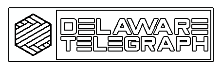

    

# MY CMS (Delaware Telegraph) (US/UK)

This project appears to be a custom content management system (CMS). According to the repository's description, it is a project written in PHP and uses a MySQL database to store and retrieve information. It also includes an administration panel that allows users to easily and quickly create and manage content.

The project code includes PHP files, as well as configuration and style (CSS) files. There is also an SQL file that is used to create the database needed for the CMS to work. If you have any more specific questions about the project, please let me know.

## How to install
1. Download the project code from GitHub and place it in the root folder of your web server.
2. Create a MySQL database and a user with permissions to access it.
3. Import the SQL file included in the project to your database. This will create the tables necessary for the CMS to function.
4. Modify the configuration file "config.php" with the connection details to your database.
5. Access the CMS URL in your web browser. For example, if you have placed it in the root folder of your web server, go to http://localhost/cms and enjoy

# MY CMS (Delaware Telegraph) (ESP)

Este proyecto parece ser un sistema de gestión de contenido (CMS) personalizado. Según la descripción del repositorio, es un proyecto escrito en PHP y usa una base de datos MySQL para almacenar y recuperar información. También incluye un panel de administración que permite a los usuarios crear y administrar fácilmente el contenido.

El código del proyecto incluye archivos PHP, así como archivos de configuración y estilo (CSS). También hay un archivo SQL que se usa para crear la base de datos necesaria para que el CMS funcione. Si tiene alguna pregunta más específica sobre el proyecto, hágamelo saber.

## Cómo instalar
1. Descargue el código del proyecto de GitHub y colóquelo en la carpeta raíz de su servidor web.
2. Cree una base de datos MySQL y un usuario con permisos para acceder a ella.
3. Importe el archivo SQL incluido en el proyecto a su base de datos. Esto creará las tablas necesarias para que el CMS funcione.
4. Modifique el archivo de configuración "config.php" con los detalles de conexión a su base de datos.
5. Acceda a la URL del CMS en su navegador web. Por ejemplo, si lo ha colocado en la carpeta raíz de su servidor web, vaya a http://localhost/cms y disfrute

# GALLERY
[Imgur: The magic of the Internet](https://imgur.com/a/XYzjc0e)

# PLUGINS
[TCPPDF](https://github.com/tcpdf/tcpdf) (PHP class for generating PDF documents and barcodes)  
[Simple File Manager]() (PHP file manager WIP)

# BRANCHES
[main](https://github.com/IOxee/My-CMS/tree/main) (The main branch)  
[dev](https://github.com/IOxee/My-CMS/tree/develop) (The development branch, without PDF generator and FS Explorer)  
[TCPDF](https://github.com/IOxee/My-CMS/tree/TCPDF) (The TCPDF branch, with TCPDF plugin)  
[CMS](https://github.com/IOxee/My-CMS/tree/CMS) (The CMS branch with FS Explorer plugin and without TCPDF plugin)  

# CREDITS
[IOxee](https://github.com/IOxee)

# DISCLAIMER
😞🙏 This project is for educational purposes only. I am not responsible for any misuse or damage caused by this program. Use it at your own risk.
At the moment only the Catalan translation file is available. sorry for the inconvenience

# LICENSE
[MIT License](https://mit-license.org/)
The MIT License (MIT)
Copyright © 2023 IOxee

Permission is hereby granted, free of charge, to any person obtaining a copy of this software and associated documentation files (the “Software”), to deal in the Software without restriction, including without limitation the rights to use, copy, modify, merge, publish, distribute, sublicense, and/or sell copies of the Software, and to permit persons to whom the Software is furnished to do so, subject to the following conditions:

The above copyright notice and this permission notice shall be included in all copies or substantial portions of the Software.

THE SOFTWARE IS PROVIDED “AS IS”, WITHOUT WARRANTY OF ANY KIND, EXPRESS OR IMPLIED, INCLUDING BUT NOT LIMITED TO THE WARRANTIES OF MERCHANTABILITY, FITNESS FOR A PARTICULAR PURPOSE AND NONINFRINGEMENT. IN NO EVENT SHALL THE AUTHORS OR COPYRIGHT HOLDERS BE LIABLE FOR ANY CLAIM, DAMAGES OR OTHER LIABILITY, WHETHER IN AN ACTION OF CONTRACT, TORT OR OTHERWISE, ARISING FROM, OUT OF OR IN CONNECTION WITH THE SOFTWARE OR THE USE OR OTHER DEALINGS IN THE SOFTWARE.
